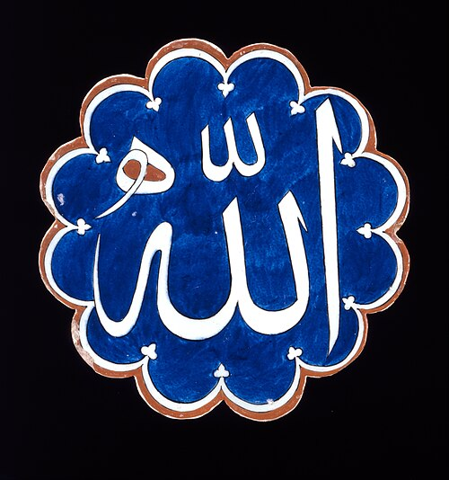

<div dir="rtl" align="right">

<p align="center">
  <a href="README.en.md">English</a> |
  <a href="README.md">فارسی</a> |
  <a href="README.ar.md">العربية</a> |
  <a href="README.ur.md">اردو</a>
</p>

<p align="center">
  
</p>

<h1 align="center">ZamanYar</h1>

<p align="center">
  <a href="https://github.com/MHitMaN/ZamanYar/releases/latest"></a>
  <a href="https://github.com/MHitMaN/ZamanYar/actions/workflows/build.yml"></a>
  <a href="LICENSE"></a>
  <a href="https://mhitman.github.io/ZamanYar/#downloads"></a>
  <a href="README.ar.md"></a>
  <a href="https://mhitman.github.io/ZamanYar/"></a>
</p>

## نظرة عامة
ZamanYar إضافة للمتصفحات Chrome وEdge وFirefox وBrave وSafari. تحول تواريخ الصفحات من الميلادي إلى الجلالي/الهجري الشمسي أو الهجري القمري، مع إعدادات مستقلة لكل موقع للأرقام والخطوط واتجاه النص ومحاذاته وصيغة التاريخ والوقت.

> "التقاويم مختلفة؛ يجب أن يبقى الوقت مقروءًا للجميع."
>
> MHitMaN

## التقويم الهجري القمري
<p align="center">
  
</p>

التقويم الهجري القمري تقويم إسلامي يعتمد على دورة القمر، وتتكون السنة فيه من 12 شهرا قمريا. في هذه الإضافة يتم توليد التاريخ الهجري القمري عبر تقويم `islamic-umalqura` المتاح في `Intl.DateTimeFormat`.

Source: https://en.wikipedia.org/wiki/Islamic_calendar

## الميزات
- تحويل التاريخ الميلادي إلى الجلالي أو الهجري القمري في صيغ Date وISO وRFC والصيغ الرقمية والنصية.
- تحويل الوقت النسبي والنصوص داخل Shadow DOM.
- تحويل الأرقام بين الفارسية والعربية والإنجليزية.
- تعريب AM/PM وتحويل الوقت اختياريا حسب المنطقة الزمنية.
- إعدادات مستقلة لكل موقع للخط، حجم الخط، الاتجاه، المحاذاة، لغة الإخراج، صيغة التاريخ وصيغة الوقت.
- حماية Datepicker وحقول الإدخال وكتل الكود وخطوط الأيقونات.

## Demo
العرض التجريبي متاح عبر الرابط:

https://mhitman.github.io/ZamanYar/

## الخطوط
لاستخدام خط مخصص، ثبّت الخط على نظام التشغيل لديك. بعد التثبيت، افتح إعداد الخط في الإضافة واختر "تحميل خطوط النظام" حتى تظهر الخطوط المثبتة في قائمة اختيار الخط.

إذا لم يوفر المتصفح API لقراءة قائمة خطوط النظام، ستظهر فقط خيارات عامة مثل `System UI` و`serif` و`sans-serif` و`monospace`.

## Build

</div>

```bash
npm install
npm run build
```

<div dir="rtl" align="right">

## Safari
تحتاج Safari Web Extension إلى التحويل إلى تطبيق Safari/Xcode ثم التوقيع والنشر عبر App Store.

## Contact
- GitHub: https://github.com/MHitMaN
- LinkedIn: https://www.linkedin.com/in/mgh71/
- Email: ghasemi71ir@gmail.com

## Donate
إذا وفر لك المشروع وقتا، يمكنك دعم الإصدارات القادمة عبر TRX أو BTC.

</div>

```text
TRX wallet: TXXW1bMV2pSeiq72hvcokCATdHjJPpAKWC
BTC wallet: bc1q6vv6f9euvv8jfw3ftv88jrp7rrflejc98uacer
```

<div dir="rtl" align="right">

## License
MIT License مع وجوب الحفاظ على حقوق النشر ونسبة المصدر وروابط الكاتب في النسخ المشتقة أو المنسوخة.

</div>
