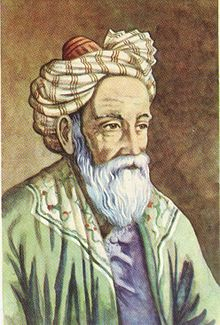

# ZamanYar

نسخه: `1.0.0`

مستندات به زبان‌های دیگر:

- [اردو](README.ur.md)
- [العربية](README.ar.md)
- [English](README.en.md)

<p align="center">
  <a href="https://fa.wikipedia.org/wiki/%D8%AE%DB%8C%D8%A7%D9%85" target="_blank">
    
  </a>
</p>

<p align="center">
  <strong>خَیّام</strong><br>
  غیاث‌الدین ابوالفتح عمر بن ابراهیم خیام نیشابوری
</p>

> گاهشمار هجری خورشیدی که مورد استفاده ما ایرانیان است، در ۶ مارس ۱۰۷۹ میلادی توسط حکیم عمر خیام نیشابوری تکمیل شد و به تقویم جلالی معروف شد.

## معرفی
ZamanYar یک افزونه مرورگر برای Chrome، Edge، Firefox، Brave و Safari است. این افزونه تاریخ‌های میلادی صفحات وب را به جلالی/شمسی یا هجری قمری تبدیل می‌کند و برای هر سایت تنظیمات جداگانه اعداد، فونت، RTL/LTR، چینش متن، فرمت تاریخ و فرمت ساعت دارد.

> «تقویم‌ها متفاوت‌اند؛ زمان باید برای همه خوانا بماند.»
>
> MHitMaN

## امکانات
- تبدیل تاریخ میلادی به شمسی یا هجری قمری در فرمت‌های رایج Date، ISO، RFC، عددی و متنی.
- تبدیل زمان نسبی مثل `5 years ago` و متن‌های داخل Shadow DOM.
- تبدیل اعداد فارسی، عربی و انگلیسی.
- بومی‌سازی AM/PM و تبدیل اختیاری ساعت بر اساس منطقه زمانی.
- تنظیمات جدا برای هر سایت شامل فونت، سایز فونت، جهت متن، چینش، زبان خروجی، فرمت تاریخ و فرمت ساعت.
- انتخاب دستی عناصر تاریخ‌دار برای مواردی که تشخیص خودکار کافی نیست.
- محافظت از Datepickerها، inputها، code blockها و آیکن‌فونت‌ها.
- پشتیبانی از SPA/AJAX و محتوایی که با delay یا scroll load می‌شود.
- پشتیبانی از localhost و فایل‌های تست توسعه.

## ساختار پروژه
```text
.
├── assets/
│   ├── images/
│   └── styles/
├── docs/
│   ├── index.html
│   ├── demo.css
│   └── demo.js
├── Languages/
│   ├── fa.json
│   ├── ur.json
│   ├── ar.json
│   └── en.json
├── src/
│   ├── background/
│   ├── content/
│   ├── options/
│   └── popup/
├── tests/
│   └── date-format-test.html
├── manifest.json
└── package.json
```

## دمو
دموی آنلاین از این لینک در دسترس است:

https://mhitman.github.io/ZamanYar/

## فونت‌ها
برای استفاده از فونت دلخواه، فونت را روی سیستم‌عامل خود نصب کنید. بعد از نصب، از بخش فونت در افزونه گزینه «بارگذاری فونت‌های سیستم» را بزنید تا فونت‌های نصب‌شده در فهرست انتخاب فونت نمایش داده شوند.

در مرورگرهایی که API لیست فونت سیستم را ارائه نکنند، فقط گزینه‌های عمومی سیستم مثل `System UI`، `serif`، `sans-serif` و `monospace` نمایش داده می‌شود.

## ساخت خروجی
```bash
npm install
npm run build
```

GitHub Actions برای Firefox، Chrome، Edge، Brave و Safari خروجی می‌سازد و روی push به `main`، `master`، `develop`، tagها، pull request و اجرای دستی فعال است.

## Safari
Safari Web Extension باید به یک اپ Safari/Xcode تبدیل و برای انتشار رسمی از مسیر App Store امضا شود. workflow پروژه روی macOS از `xcrun safari-web-extension-converter` استفاده می‌کند.

مرجع Apple: https://developer.apple.com/documentation/safariservices/packaging-a-web-extension-for-safari

## صفحه تست
برای تست فرمت‌های رایج تاریخ و ساعت میلادی، بعد از load کردن افزونه فایل `tests/date-format-test.html` را باز کنید.

برای صفحات مستقیم `file://` در Chrome/Edge باید گزینه `Allow access to file URLs` را برای افزونه فعال کنید.

صفحات داخلی مرورگر مثل New Tab پیش‌فرض با content script قابل تغییر نیستند. پشتیبانی از New Tab فقط با جایگزین‌کردن آن با صفحه New Tab خود افزونه ممکن است.

## کتابخانه‌ها و تبدیل تقویم
تبدیل جلالی از الگوریتم `jalaali-js` در فایل محلی `src/content/jalaali.js` استفاده می‌کند.

Source: https://github.com/jalaali/jalaali-js

تبدیل هجری قمری با تقویم `islamic-umalqura` در `Intl.DateTimeFormat` مرورگر انجام می‌شود و کتابخانه جداگانه runtime برای آن bundle نشده است.

Reference: https://en.wikipedia.org/wiki/Islamic_calendar

## ذخیره تنظیمات
- تنظیمات عمومی در `chrome.storage.local` ذخیره می‌شوند.
- زبان UI در `uiLanguage` ذخیره می‌شود و از `Languages/*.json` خوانده می‌شود.
- تنظیمات اختصاصی هر سایت در `siteSettings` بر اساس hostname ذخیره می‌شود.
- وضعیت فعال/غیرفعال هر دامنه در `domainOverrides` ذخیره می‌شود.
- selectorهای انتخاب‌شده در `domainSelectors` ذخیره می‌شوند.

## ارتباط
- GitHub: https://github.com/MHitMaN
- LinkedIn: https://www.linkedin.com/in/mgh71/
- Email: ghasemi71ir@gmail.com

## حمایت مالی
اگر این افزونه به کارت آمد، با TRX یا BTC از توسعه نسخه‌های بهتر حمایت کن.

```text
TRX wallet: TXXW1bMV2pSeiq72hvcokCATdHjJPpAKWC
BTC wallet: bc1q6vv6f9euvv8jfw3ftv88jrp7rrflejc98uacer
```

## مجوز
مجوز MIT است، با الزام حفظ کپی‌رایت، ذکر منبع اصلی و لینک‌های نویسنده در نسخه‌های کپی‌شده یا مشتق‌شده.

Copyright (c) 2026 MHitMaN
